[hello_world/complexity_scale.sh](src/hello_world/complexity_scale.sh)

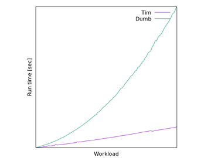

[multivariate/multiAttrs.sh](src/multivariate/multiAttrs.sh)

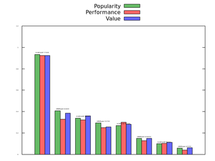

[plotting/kernel_density.sh](src/plotting/kernel_density.sh)

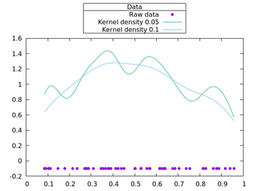

[plotting/simple_gallery.sh](src/plotting/simple_gallery.sh)

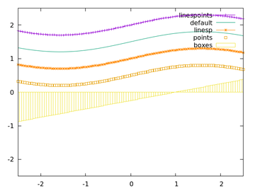

[plotting/smooth_acsplines_bestfitting.sh](src/plotting/smooth_acsplines_bestfitting.sh)

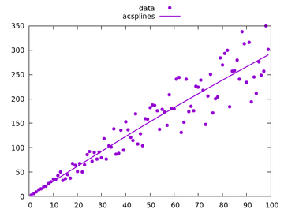

[plotting/uniqueness.sh](src/plotting/uniqueness.sh)

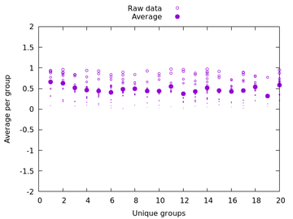

[plotting/palette_squaremap.sh](src/plotting/palette_squaremap.sh)

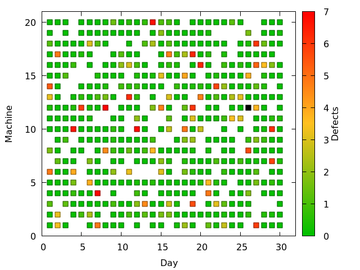

[plotting/smooth_interpolation.sh](src/plotting/smooth_interpolation.sh)

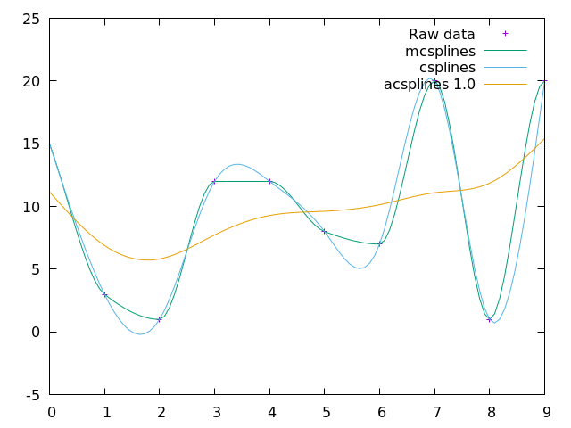

[plotting/frequency.sh](src/plotting/frequency.sh)

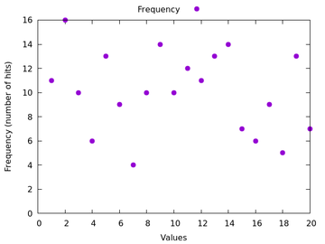

[plotting/palette_colorpointcloud.sh](src/plotting/palette_colorpointcloud.sh)

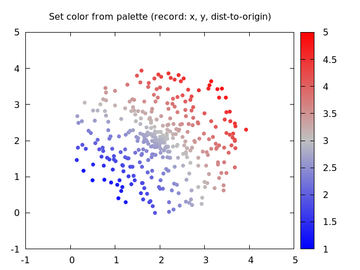

[plotting/sampling_rate.sh](src/plotting/sampling_rate.sh)

[timeSeries/cumulativeSum.sh](src/timeSeries/cumulativeSum.sh)

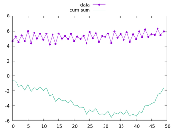

[timeSeries/eventLogsDifferencing.sh](src/timeSeries/eventLogsDifferencing.sh)

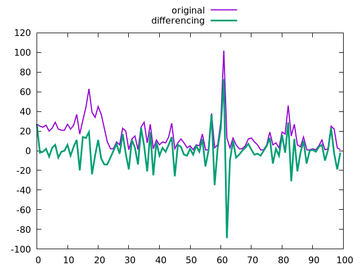

[timeSeries/standardDeviation.sh](src/timeSeries/standardDeviation.sh)

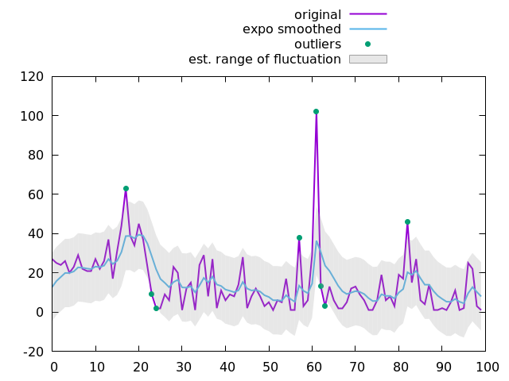

[timeSeries/eventLogsExpoSmoothing.sh](src/timeSeries/eventLogsExpoSmoothing.sh)

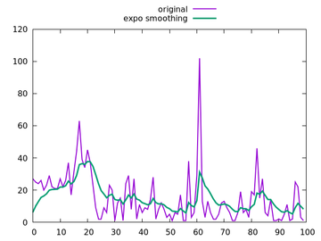

[pieCharts/pie.sh](src/pieCharts/pie.sh)

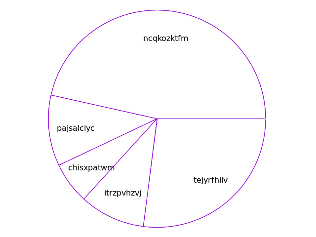

[execution/oneliners.sh](src/execution/oneliners.sh)

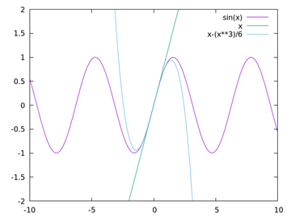

[rankedData/rankOrder.sh](src/rankedData/rankOrder.sh)

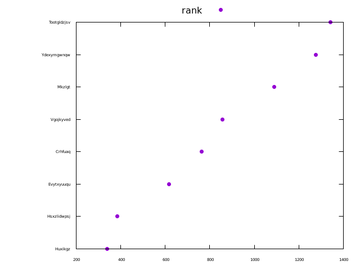

[rankedData/horizontalRank.sh](src/rankedData/horizontalRank.sh)

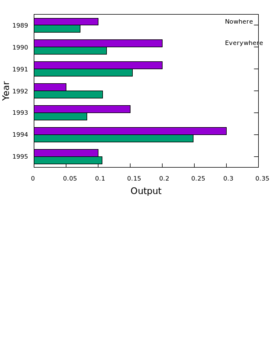

[distribution/boxplots.sh](src/distribution/boxplots.sh)

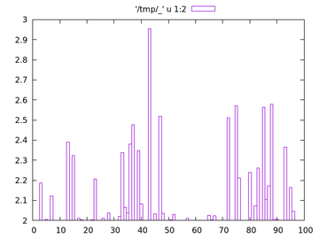

[distribution/kernelDensity.sh](src/distribution/kernelDensity.sh)

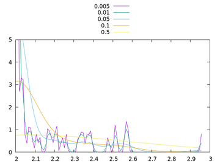

[distribution/histograms.sh](src/distribution/histograms.sh)

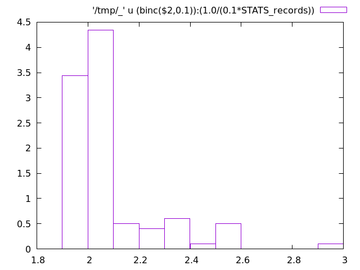

[distribution/cumulativeDist.sh](src/distribution/cumulativeDist.sh)

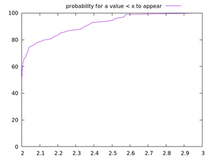

[logarithmic/largeVariations.sh](src/logarithmic/largeVariations.sh)

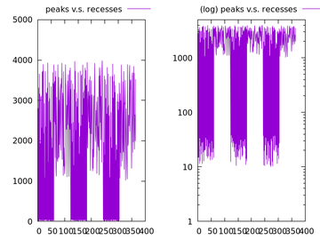

[data_files/columns.sh](src/data_files/columns.sh)

[data_files/key_autotitle_columnhead.sh](src/data_files/key_autotitle_columnhead.sh)

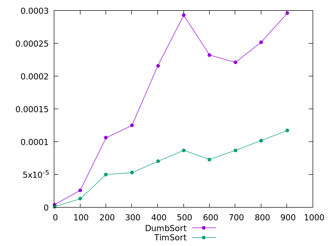

[data_files/withLabels.sh](src/data_files/withLabels.sh)

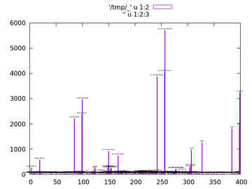

[data_files/iterate_all_columns.sh](src/data_files/iterate_all_columns.sh)

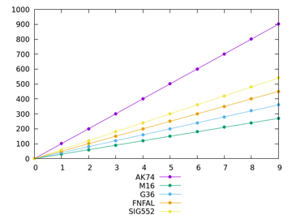

[data_files/strings.sh](src/data_files/strings.sh)

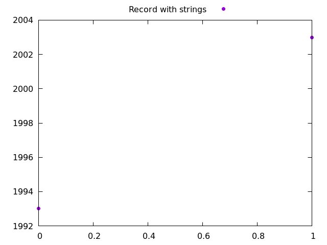

[graph/multiple_datasets.sh](src/graph/multiple_datasets.sh)

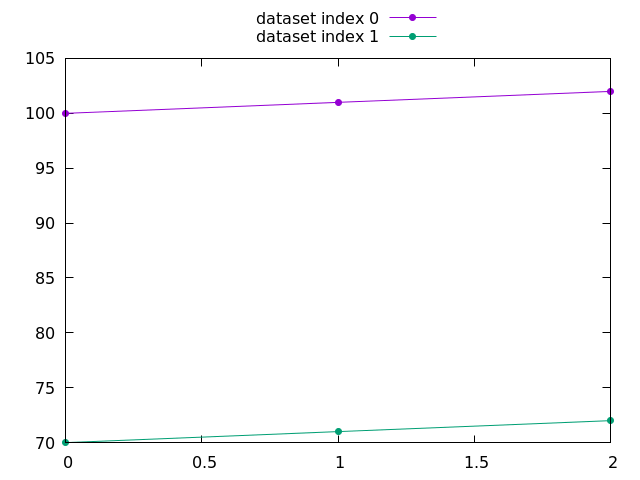

[graph/multiplot.sh](src/graph/multiplot.sh)

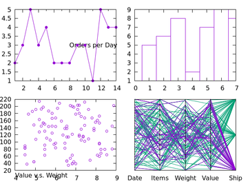

