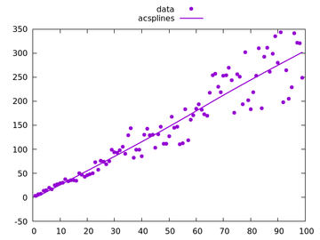
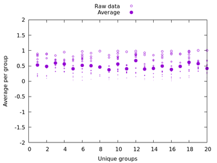
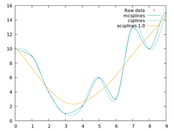
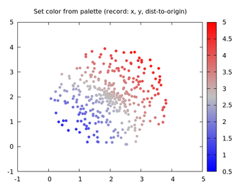
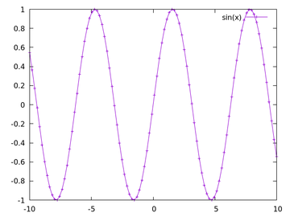
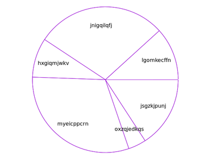
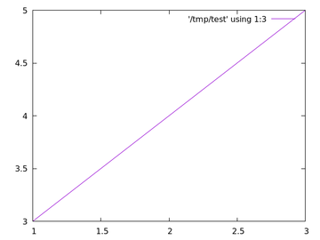
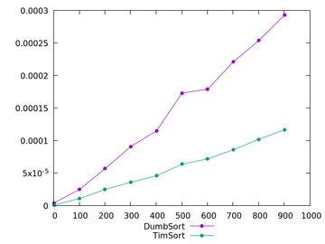
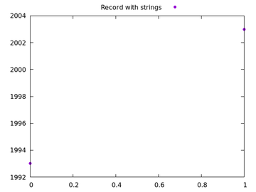
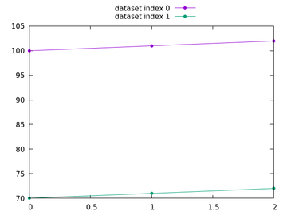

Gnuplot Examples
----------------

This project is created for learning purpose.

It started as a side project when I was looking for a simple, battery-included plotting utility to
implement a software profiling toolkit at work.

Gnuplot stood out of all the candidates because:

- It creates decent 2D graphs.

- It has the least amount of dependencies.
I can either download and unzip the binary or build it from the source.
After that it is fully functional (you can verify that by running all
the example scripts below).

- It uses text files as the main source of input data. This greatly simplifies the tooling.

- It is hackable via scripting but does not force the users to learn another programming language.
Matlab and Python's Metaplot are great but to entry-level users the learning curve can be steep.

This project is loosely based on the examples in
[Gnuplot in Action, second edition](https://www.manning.com/books/gnuplot-in-action-second-edition).

All the examples were written and tested on Ubuntu 16.

Script Gallery
--------------

[hello_world/complexity_scale.sh](src/hello_world/complexity_scale.sh)

[multivariate/multiAttrs.sh](src/multivariate/multiAttrs.sh)

[plotting/kernel_density.sh](src/plotting/kernel_density.sh)

[plotting/simple_gallery.sh](src/plotting/simple_gallery.sh)

[plotting/smooth_acsplines_bestfitting.sh](src/plotting/smooth_acsplines_bestfitting.sh)

[plotting/uniqueness.sh](src/plotting/uniqueness.sh)

[plotting/palette_squaremap.sh](src/plotting/palette_squaremap.sh)

[plotting/smooth_interpolation.sh](src/plotting/smooth_interpolation.sh)

[plotting/frequency.sh](src/plotting/frequency.sh)

[plotting/palette_colorpointcloud.sh](src/plotting/palette_colorpointcloud.sh)

[plotting/sampling_rate.sh](src/plotting/sampling_rate.sh)

[timeSeries/cumulativeSum.sh](src/timeSeries/cumulativeSum.sh)

[timeSeries/eventLogsDifferencing.sh](src/timeSeries/eventLogsDifferencing.sh)

[timeSeries/standardDeviation.sh](src/timeSeries/standardDeviation.sh)

[timeSeries/eventLogsExpoSmoothing.sh](src/timeSeries/eventLogsExpoSmoothing.sh)

[pieCharts/pie.sh](src/pieCharts/pie.sh)

[execution/oneliners.sh](src/execution/oneliners.sh)

[rankedData/rankOrder.sh](src/rankedData/rankOrder.sh)

[rankedData/horizontalRank.sh](src/rankedData/horizontalRank.sh)

[distribution/boxplots.sh](src/distribution/boxplots.sh)

[distribution/kernelDensity.sh](src/distribution/kernelDensity.sh)

[distribution/histograms.sh](src/distribution/histograms.sh)

[distribution/cumulativeDist.sh](src/distribution/cumulativeDist.sh)

[logarithmic/largeVariations.sh](src/logarithmic/largeVariations.sh)

[data_files/columns.sh](src/data_files/columns.sh)

[data_files/key_autotitle_columnhead.sh](src/data_files/key_autotitle_columnhead.sh)

[data_files/withLabels.sh](src/data_files/withLabels.sh)

[data_files/iterate_all_columns.sh](src/data_files/iterate_all_columns.sh)

[data_files/strings.sh](src/data_files/strings.sh)

[graph/multiple_datasets.sh](src/graph/multiple_datasets.sh)

[graph/multiplot.sh](src/graph/multiplot.sh)

